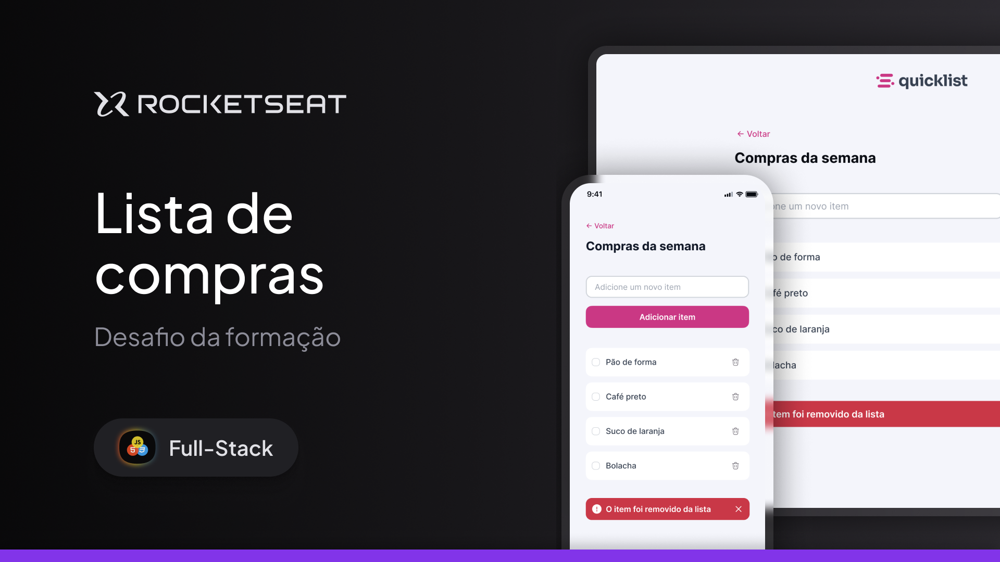

# 🛒 Quicklist – Lista de Compras

Protótipo de uma aplicação de **lista de compras** desenvolvida com foco em **UI/UX**, **responsividade** e **organização de layout**, apresentando versões para **desktop e mobile**.

## 📸 Pré-visualização

Interface de lista de compras com visual limpo e moderno, exibindo:
- Versão desktop
- Versão mobile
Ambas com a mesma experiência de uso e adaptação de layout.

## 🛠 Tecnologias utilizadas
- HTML5
- CSS3
- Design responsivo
- Conceitos de UI/UX

## ✨ Características do projeto
- Adição de novos itens à lista
- Lista organizada de compras semanais
- Ações de remover itens
- Feedback visual para ações do usuário
- Layout adaptado para desktop e mobile
- Interface simples, intuitiva e funcional

## ▶️ Como visualizar o projeto
1. Baixe ou clone este repositório
2. Abra o arquivo `index.html` no navegador

## 📚 Aprendizados
- Criação de interfaces responsivas
- Organização de componentes reutilizáveis
- Hierarquia visual aplicada a listas
- Melhoria da experiência do usuário em aplicações simples

## 🚀 Próximos passos
- Implementar JavaScript para interatividade completa
- Salvar itens no localStorage
- Criar animações sutis para ações (adicionar/remover)
- Melhorar acessibilidade e navegação por teclado
